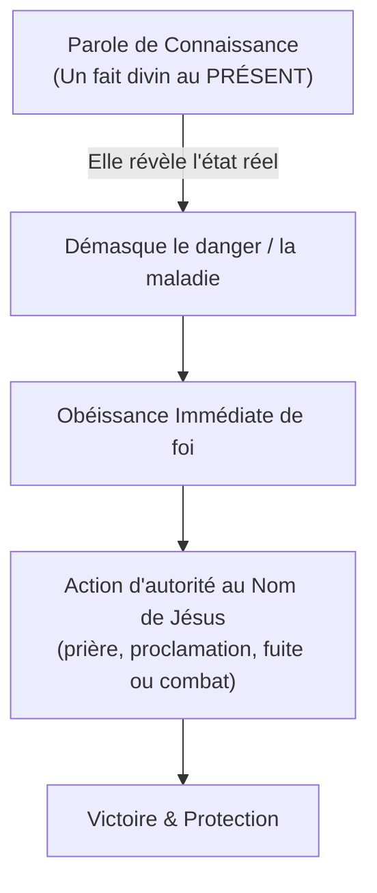

# 📖 Le Don de la Parole de Connaissance — Norvel Hayes

> *Fiche de lecture accessible et pratique — 18 septembre 2026*

---

## 🎯 Message central

La parole de connaissance n'est pas une longue étude théologique ni une encyclopédie biblique. C'est **un fragment de la connaissance de Dieu communiqué directement à notre esprit pour nous faire connaître la condition exacte d'une chose, d'une personne ou d'une situation MAINTENANT**.

Norvel Hayes explique avec un style très direct et percutant que ce don est une **arme de guerre** indispensable pour démasquer le diable, éviter des pièges mortels, apporter la délivrance et sauver des vies.

> « À l'un est donnée par l'Esprit la parole de sagesse ; à l'autre la parole de connaissance, par le même Esprit... » — **1 Corinthiens 12:8**

---

## 💡 1. Qu'est-ce que la Parole de Connaissance ? (Chapitre 1)

### La différence entre Parole de Connaissance et Parole de Sagesse
Beaucoup de chrétiens confondent ces deux dons jumeaux :
* **La Parole de Connaissance traite du PRÉSENT :** Elle vous révèle la condition des choses telles qu'elles existent en ce moment même (un fait caché, une maladie, un danger immédiat, l'état d'un cœur).
* **La Parole de Sagesse traite du FUTUR :** Elle montre la direction à prendre, le plan de Dieu pour l'avenir ou la manière de régler un problème.

### Ce que le don fait et ce qu'il ne fait pas
* **Il vous donne l'information, mais il ne règle pas le problème à votre place.**
* Quand Dieu vous montre que quelque chose ne va pas, Il vous donne l'avantage du terrain. Mais ensuite, **c'est à vous d'agir** :
  1. Prendre autorité au nom de Jésus et briser le pouvoir du diable.
  2. Proclamer la victoire de votre bouche.
  3. Prier en langues jusqu'à ce que la paix et la note de victoire montent dans votre cœur.

> [!TIP]
> **L'histoire du jeune homme à Chattanooga :**
> Alors que Norvel était dans un centre commercial, le Saint-Esprit lui dit simplement : *« Va à Chattanooga, à tel endroit »*. Dieu ne lui explique rien d'avance. En arrivant, il découvre un jeune homme brisé mentalement, totalement possédé. Norvel a combattu et prié en langues pendant 8 heures d'affilée jusqu'à ce que les démons le lâchent et que le garçon retrouve sa pleine lucidité.

---

## 👥 2. Vous avez besoin des Dons de l'Esprit (Chapitre 2)

Norvel Hayes s'attaque à la fausse humilité de certains chrétiens :

* **Arrêter de dire « je ne suis pas digne » :** Si vous êtes né de nouveau et rempli du Saint-Esprit, la manifestation de l'Esprit vous est donnée pour votre profit et celui des autres (1 Corinthiens 12:7).
* **L'analogie du corps :** Dans 1 Corinthiens 12:21, l'œil ne peut pas dire à la main : *« Je n'ai pas besoin de toi »*. De même, aucun croyant ne peut dire : *« J'ai ma Bible et ma petite prière, je n'ai pas besoin des dons surnaturels »*.
* Vous en avez un besoin vital. Si vous refusez les dons de l'Esprit, vous finirez par devoir régler tous vos combats avec vos seules forces humaines.

---

## ⚡ 3. Obéir Rapidement (Chapitre 3)

Quand une parole de connaissance arrive, le piège est d'hésiter ou de marchander avec Dieu en disant : *« Pourquoi, Seigneur ? Explique-moi d'abord »*.

* **Dieu est un Dieu de foi :** Il vous donne juste deux ou trois mots. Si vous bougez par la foi, Il vous donnera la suite. Si vous attendez de tout comprendre, vous manquerez le rendez-vous.
* **L'église perdue dans les montagnes :**
  * La femme d'un pasteur reçoit en prière le nom de Norvel Hayes et l'invite dans une minuscule église isolée sur une route de gravier en Géorgie.
  * L'Esprit dit à Norvel : *« Va vite ! »*.
  * Dès son arrivée, Dieu lui dit de faire les cent pas devant l'estrade en pleurant sous l'Esprit : la puissance de Dieu tombe sur toute la salle, et une famille entière liée par l'ennemi depuis des années est sauvée et délivrée.
  * **La bénédiction en retour :** Pendant qu'il était fidèle à ce petit appel, Dieu lui a donné une parole pour acheter une propriété qui lui a rapporté des centaines de milliers de dollars. Quand on s'occupe des affaires de Dieu d'abord, Il prend soin des nôtres.

---

## 📖 4. La Parole de Connaissance dans la Bible (Chapitre 4)

### Dans l'Ancien Testament : Le prophète Élisée (2 Rois 6:8-12)
* Le roi de Syrie déclarait la guerre à Israël et préparait des embuscades secrètes.
* Mais Dieu donnait à Élisée une parole de connaissance pour avertir le roi d'Israël : *« Ne passe pas par là, les Syriens y sont cachés »*.
* Élisée a sauvé l'armée d'Israël plusieurs fois, au point que le roi ennemi croyait qu'il y avait un traître dans sa propre chambre à coucher.

### Dans le Nouveau Testament : Pierre et Corneille (Actes 10)
* Corneille a reçu la visite d'un ange lui disant d'envoyer chercher Pierre.
* Pierre, de son côté, était en train de prier sur un toit. Le Saint-Esprit lui donne une parole de connaissance toute simple : *« Voici, trois hommes te cherchent. Lève-toi, descends et va avec eux sans hésiter »*.
* Pierre ne savait pas encore pourquoi il partait, mais son obéissance immédiate a ouvert la porte du salut pour toutes les nations non-juives.

---

## 🛡️ 5. À quoi ça sert ? Des Avertissements pour Sauver des Vies (Chapitre 5)

La parole de connaissance fonctionne souvent comme un **radar divin** pour nous éviter des tragédies.

### Les exemples vécus par Norvel Hayes :

1. **Le cambriolage du restaurant :** Dieu le réveille à 5h du matin en disant : *« Danger sur ton restaurant aujourd'hui »*. Cela lui a permis d'être préparé et d'identifier le voleur.
2. **Sauvé d'une agression à main armée :**
   * Un soir en voiture, l'Esprit lui dit soudain : *« Attention, danger devant toi »*.
   * Une voiture le percute volontairement par l'arrière et le colle de près, avec un homme armé à bord.
   * L'Esprit lui montre exactement quoi faire : tourner dans une rue précise, entrer immédiatement dans une maison et appeler la police. Sa vie a été sauvée ce soir-là parce qu'il n'a pas paniqué et a écouté l'avertissement.
3. **Le drame de Jeanie (Quand on refuse d'écouter) :**
   * Alors qu'il conduit sur l'autoroute, Dieu lui montre le visage d'une jeune chrétienne de sa ville, Jeanie, en lui disant : *« ATTENTION, elle va entrer dans un nuage noir. Dis-lui de fuir et de courir ! »*.
   * Norvel va la voir. Jeanie lui avoue qu'elle fréquente un très beau garçon rencontré à la plage et qu'elle veut l'épouser.
   * Norvel la supplie : *« Jeanie, prends garde, fuis maintenant ! »*.
   * Elle refuse d'écouter parce que le garçon est séduisant. Elle l'épouse et découvre qu'il s'agissait d'un gigolo manipulateur qui profitait d'elle. Elle a vécu cinq années de cauchemar et de larmes pour avoir ignoré une parole de connaissance.

> [!WARNING]
> **Quand Dieu prévient, ce n'est jamais pour rien :** Le diable prépare des pièges en silence. La parole de connaissance est la lampe torche de Dieu qui éclaire le piège avant que nous ne tombions dedans.

---

## 📋 En Résumé : Comment coopérer avec ce don

* [ ] **Rester disponible :** Se rappeler que Dieu parle pour protéger et aider, pas pour satisfaire la curiosité.
* [ ] **Agir tout de suite :** Ne pas attendre des jours quand le Saint-Esprit donne une impulsion ou un avertissement.
* [ ] **Prendre autorité :** Quand Dieu montre une œuvre du diable (maladie, oppression, danger), briser son pouvoir au nom de Jésus.
* [ ] **Chérir le don :** Traiter les manifestations de l'Esprit avec respect et reconnaissance, sans jamais s'en vanter.
