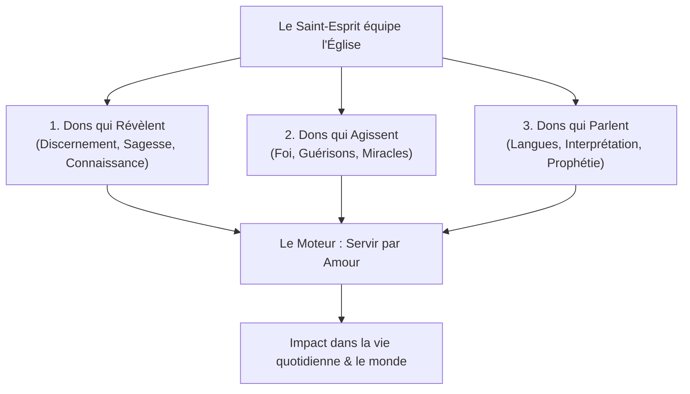

# 📖 Libérer Les Dons Spirituels Aujourd'Hui — James W. Goll

> *Fiche de lecture pratique et accessible — 18 septembre 2026*

---

## 🎯 Message central

Les dons du Saint-Esprit ne sont pas des théories à étudier dans un bureau, ce sont des **outils de travail pour la vie de tous les jours**. Dieu ne les a pas réservés aux pasteurs ou à une élite sur une estrade : ils sont destinés à chaque croyant, dans la rue, au bureau, à l'épicerie ou autour d'un café.

Le mot d'ordre de James Goll est simple : **« Just do it ! » (Faites-le !)**. La foi s'écrit **R-I-S-Q-U-E**. Pour voir Dieu agir, il faut accepter de sortir de sa zone de confort, d'enlever les mains de ses poches et d'oser faire un pas, même avec le risque de paraître maladroit.

> « Mais à chacun la manifestation de l'Esprit est donnée pour le bien commun. » — **1 Corinthiens 12:7**

---

## 🌈 L'analogie de l'Arc-en-Ciel

James Goll compare souvent les 9 dons de l'Esprit aux couleurs d'un arc-en-ciel :
* Quand on regarde un arc-en-ciel, il est impossible de dire exactement où s'arrête le jaune et où commence le vert. Les couleurs se mélangent et coulent ensemble.
* Les dons spirituels fonctionnent de la même manière : une **parole de connaissance** donne une information cachée, ce qui déclenche un élan du **don de la foi**, qui débouche immédiatement sur un **don de guérison**. Ne cherchez pas à tout enfermer dans des cases rigides !

---

## 📚 Les 4 Grandes Sections du Livre

---

### SECTION 1 : COMPRENDRE ET MARCHER AVEC LE SAINT-ESPRIT (Chapitres 1 à 3)

#### 1. Des outils, pas des jouets (Chapitre 1)
* **Pourquoi les dons existent-ils ?** Pour aimer et aider les gens. Les dons ne mesurent pas à quel point Dieu vous aime personnellement ; ils montrent à quel point Dieu aime la personne en face de vous à travers vous.
* **L'histoire marquante d'Albanie (1992) :**
  Dans une salle glaciale du nord de l'Albanie, sans musique ni confort, James reçoit une pensée insistante : le prénom « Sarah ». En demandant la traduction en albanais (*Sabrina*), une femme se lève. James lui révèle son âge (32 ans), qu'elle n'a jamais entendu parler de Jésus et qu'elle a une tumeur au sein. Bouleversée, elle donne sa vie à Christ. Plus tard dans la nuit, faute de taxi, une voiture s'arrête sur une route sombre : le conducteur n'est autre que le mari de Sabrina, qui se convertit lui aussi dans la voiture !

#### 2. Comment coopérer avec l'Esprit (Chapitre 2)
* Le Saint-Esprit est comparé à une colombe : Il est doux, sensible et calme. Il ne s'impose jamais par la force.
* **Ce qu'il faut éviter :**
  * *N'attristez pas l'Esprit :* Les critiques, les commérages et les paroles dures font reculer Sa présence (*Éphésiens 4:29-31*).
  * *N'éteignez pas le feu :* Ne méprisez pas les dons par peur ou par contrôle humain (*1 Thess 5:19*).
* **Être continuellement rempli :** Le verbe dans Éphésiens 5:18 signifie *« continuez à être remplis »*. Nous sommes tous des vases qui ont tendance à fuir au fil de la journée ; il faut revenir chaque matin faire le plein auprès de la Source.

#### 3. Grandir dans l'exercice des dons (Chapitre 3)
* **Pas de chrétien « patate douce » :** On ne développe pas ses muscles spirituels en restant assis dans son canapé à regarder les autres faire. Il faut pratiquer.
* **L'esprit de service :** Les dons fleurissent dans l'humilité. James raconte comment son ami l'apôtre Ché Ahn a gagné le cœur de toute une équipe pastorale simplement en débarrassant la table après le repas.
* **Semer et récolter :** Quand James était jeune, il a servi fidèlement un évangéliste de guérison (Mahesh Chavda) en portant ses valises et en lui apportant ses repas. La récompense récoltée ? La guérison miraculeuse de la stérilité de son épouse, qui a ensuite donné naissance à 4 enfants.

---

### SECTION 2 : LES DONS QUI RÉVÈLENT (Chapitres 4 à 6)

#### 4. Le Discernement des Esprits (Le compteur Geiger)
* **Ce que c'est :** La capacité surnaturelle de percevoir ce qui se passe dans le monde invisible (détecter la présence du Saint-Esprit, des anges, l'état du cœur humain, ou des démons).
* **Ce que ce n'est PAS :** Ce n'est **PAS le don de suspicion**. Utiliser son intuition pour juger ou critiquer les autres fait le jeu du diable, l'accusateur des frères.
* **Le test infaillible (1 Jean 4:1-3) :** Tout esprit qui confesse que Jésus-Christ est venu en chair est de Dieu.

#### 5. La Parole de Sagesse (Les solutions de Dieu)
* **La différence :** La connaissance donne les faits, mais la sagesse montre **comment appliquer ces faits** et quoi faire. C'est le don des « solutions d'espoir ».
* **Exemple biblique :** Salomon proposant de couper le bébé en deux (1 Rois 3). Cette idée semblait folle, mais elle a fait jaillir la vérité du cœur de la vraie mère.
* **Comment elle vient :** Par un coup de pouce silencieux dans le cœur, un verset biblique qui s'illumine tout d'un coup, ou une réflexion sage en équipe (*Actes 15*).

#### 6. La Parole de Connaissance (Des faits au présent)
* **Ce que c'est :** Une information précise que Dieu dépose dans notre esprit sur une personne (un nom, un passé caché, une maladie).
* **Les histoires de James :**
  * *Conrad d'Allahabad :* À Londres, James voit flotter dans sa tête les lettres « Al-la-ha-bad ». Il interpelle un homme indien au premier rang. Cet homme s'appelait Conrad, venait d'Allahabad en Inde et avait dépensé toutes ses économies pour venir chercher le réveil.
  * *Daniel et les 12 Elizabeth :* À Long Island, James appelle « Daniel de Schenectady » (une ville dont il ignorait l'existence), puis appelle 12 femmes prénommées Elizabeth qui sont toutes guéries de la même affection le soir même.
  * *Le cheesecake à l'épicerie :* En allant acheter un gâteau, l'Esprit le dirige vers un autre magasin où une jeune maman le cherchait après avoir été baptisée dans l'Esprit la veille.

---

### SECTION 3 : LES DONS QUI AGISSENT (Chapitres 7 à 9)

#### 7. Le Don de la Foi (La fusée d'appoint)
* Ce n'est pas la foi ordinaire que chaque chrétien utilise pour croire en Dieu. C'est une poussée surnaturelle de certitude divine où le doute devient totalement impossible.
* **La clé secrète de la foi : Le pardon (Marc 11:25).** La rancune et l'amertume coupent immédiatement le flux de la foi.
* **Le témoignage personnel du cancer :** Atteint d'une récidive de lymphome avec un système immunitaire au plus bas, James reçoit l'imposition des mains d'Oral Roberts (90 ans) pendant 15 secondes : *« J'ordonne à chaque cellule cancéreuse de se dessécher »*. Un éclair de foi le frappe : le cancer a disparu et n'est jamais revenu.
* L'exemple de Smith Wigglesworth qui a ressuscité son épouse Polly par une foi inébranlable.

#### 8. Les Dons de Guérisons (Au pluriel)
* Il n'y a pas qu'une seule façon de guérir : prière directe, onction d'huile des anciens (*Jacques 5:14*), prière de repos (« trempage »), ou prise de la sainte Cène avec foi (*1 Cor 11*).
* **La persévérance paie :** L'histoire d'Haïti avec Mahesh Chavda. Une petite-fille amène sa grand-mère aveugle cinq soirs de suite. Les quatre premiers soirs, rien ne se passe. Le cinquième soir, la femme est guérie et voit parfaitement. Dieu a montré plus tard en vision que chaque prière avait brisé un tentacule qui retenait cette cécité.

#### 9. Le Fonctionnement des Miracles
* Les miracles vont au-delà des lois naturelles (l'eau changée en vin à Cana, la multiplication des pains).
* **Dieu utilise notre obéissance :** Moïse a dû lever son bâton pour ouvrir la mer. L'homme apporte son obéissance, Dieu apporte la puissance.
* **Le secret d'Oral Roberts au fils de James :** *« Si tu veux voir des miracles et des guérisons, apprends à aimer les malades »*.

---

### SECTION 4 : LES DONS QUI PARLENT (Chapitres 10 à 12)

#### 10. Le Parler en Langues
* C'est la porte d'entrée vers les autres dons. Prier en langues élève notre esprit, apaise nos pensées et nous permet de prier parfaitement la volonté de Dieu (*Romains 8:26*).
* **Des langues réelles :** James raconte comment il a parlé sans le savoir en coréen et en *k'iche'* (un dialecte maya du Guatemala), appelant une centaine d'indigènes vêtus du même habit traditionnel à venir donner leur vie à Jésus.
* **En assemblée :** Quand 5 000 pasteurs en Corée ont prié ensemble en langues pendant 30 minutes, un dirigeant chrétien plongé dans le coma s'est réveillé à l'hôpital au même moment.

#### 11. L'Interprétation des Langues
* Ce n'est pas une traduction mot à mot, mais la restitution du sens général (*l'équivalent dynamique*).
* On peut prier en langues dans le secret pendant quelques minutes, puis s'arrêter et noter ce qui monte en français : c'est souvent l'interprétation de notre prière.

#### 12. Le Don de Prophétie
* **Le but biblique (1 Cor 14:3) :** Édifier, exhorter et consoler. Elle sert à détruire la condamnation et le découragement.
* **Les 4 niveaux :**
  1. *L'atmosphère prophétique :* Où tout le monde peut prophétiser sous la présence de Dieu (comme Saül dans 1 Sam 19).
  2. *Le don de prophétie :* Accessible à chaque croyant rempli de l'Esprit.
  3. *Le ministère prophétique :* Une personne qui pratique régulièrement ce don.
  4. *La fonction de prophète :* Un ministère reconnu qui forme et équipe les autres.
* **Les 9 tests pour éprouver une prophétie :** S'accorde-t-elle avec la Bible ? Exalte-t-elle Jésus ? Porte-t-elle du bon fruit ? Produit-elle la paix et la liberté ?

---

## 🧭 Plan d'action pour votre quotidien

- [ ] **Prendre un risque bienveillant :** Dès que vous ressentez une pensée d'encouragement pour un collègue ou un inconnu, partagez-la avec simplicité.
- [ ] **Activer la prière en langues :** Prendre 15 à 30 minutes chaque jour pour prier dans l'Esprit afin de booster vos sens spirituels.
- [ ] **Garder le cœur pur :** Pratiquer le pardon immédiat pour laisser l'onction couler sans aucun blocage.
- [ ] **Aimer avant de chercher la puissance :** Toujours se rappeler que les dons ne servent qu'à une seule chose : montrer aux gens l'amour réel et vivant de Jésus.
