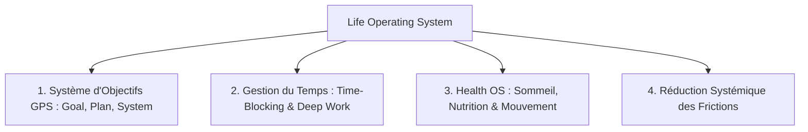

# Synthèse Intégrale : Stratégies d'Organisation et Maîtrise de la Gestion du Temps

## Synthèse de Premier Niveau : Les Piliers de l'Efficacité Durable

La performance systémique ne relève pas d'un surcroît de volonté, mais d'une transition structurelle du mode réactif vers le mode proactif. La pathologie organisationnelle moderne réside dans la "réactivité aux urgences", où l'individu épuise ses ressources attentionnelles à traiter des stimuli immédiats au détriment de l'impact stratégique. À l'inverse, la proactivité consiste à sanctuariser les tâches à haute valeur ajoutée avant que le manque d'anticipation ne les transforme en crises.

L'efficacité durable repose sur quatre principes cardinaux identifiés par la psychologie cognitive :

- **La gratification (vs punition) :** Le système dopaminergique, moteur de l'action, répond plus efficacement aux mécanismes de récompense (cochage de listes, micro-victoires) qu'à la culpabilité, particulièrement en contexte de dysfonction exécutive.
- **La priorisation factuelle :** L'utilisation de la Matrice d'Eisenhower permet de substituer l'analyse objective à la pression émotionnelle de l'urgence.
- **Le coût cognitif du multitâche :** Le cerveau humain ne traite pas les tâches en parallèle ; il alterne entre elles avec un coût de transition massif.
- **L'architecture de l'environnement :** La structuration de l'écosystème visuel et social détermine la capacité à maintenir un état de concentration profonde ("flow").

## Section I : Psychologie et État d'Esprit : Au-delà de la Volonté

### Le piège du perfectionnisme

Le perfectionnisme n'est pas une quête d'excellence, mais une recherche de l'inatteignable dictée par la peur de l'échec. Selon l'Université Laval, ce trait résulte d'un entrelacement de facteurs génétiques (tempérament héréditaire), familiaux (exigences parentales élevées) et culturels (valorisation sociale de la performance exceptionnelle).

| Caractéristique         | Personne Consciencieuse                        | Personne Perfectionniste                     |
| ----------------------- | ---------------------------------------------- | -------------------------------------------- |
| **Standards**           | Réalistes et humainement possibles.            | Inatteignables, extrêmes ou illusoires.      |
| **Flexibilité**         | Ajuste les exigences selon le contexte.        | Inflexible, surinvestissement sur le mineur. |
| **Gestion de l'erreur** | Accepte l'erreur comme levier d'apprentissage. | Erreur vécue comme une défaite cuisante.     |
| **Vision de soi**       | Valeur personnelle distincte des actes.        | Valeur corrélée aux succès et à la réussite. |
| **Sentiment dominant**  | Satisfaction et réalisme face à l'avenir.      | Anxiété, honte et appréhension de l'échec.   |

### Le syndrome de la gratification immédiate

Le cerveau est biologiquement attiré par "l'objet brillant" : des micro-tâches simples (emails, notifications) offrant une dopamine rapide. Ce biais cognitif s'oppose au principe de Pareto (20/80), où 20 % des efforts produisent 80 % des résultats. Privilégier le traitement quantitatif maintient l'individu dans une zone de futilité productive.

## Section II : Méthodologies de Priorisation et Planification Stratégique

### La Matrice d'Eisenhower et la Méthode ABCDE

La priorisation objective nécessite de distinguer l'urgent (temps) de l'important (impact) :

- **Quadrant 1 (Urgent/Important) :** Traiter immédiatement (crises, dossiers à échéance).
- **Quadrant 2 (Non Urgent/Important) :** Planifier. C'est le quadrant de la vision et de la croissance.
- **Quadrant 3 (Urgent/Non Important) :** Déléguer ou regrouper.
- **Quadrant 4 (Ni Urgent ni Important) :** Supprimer.

La méthode **ABCDE** affine ce tri : de **A** (priorité absolue avec conséquences graves) à **E** (éliminable sans impact).

### La gestion du temps réel

L'humain sous-estime structurellement la durée des tâches. Pour pallier ce biais :

- **Règle des 20 % :** Ajouter systématiquement 20 % de temps tampon pour absorber l'imprévu.
- **Chunking (Découpage) :** Diviser les projets en blocs d'une heure maximum pour faciliter l'estimation et maintenir l'engagement cognitif.

## Section III : Les Saboteurs de Productivité : Analyse des Coûts Cachés

### Le Mythe du Multitâche

Les études de Rubenstein, Evans et Meyer démontrent que le multitâche entraîne une perte de **40 % du temps effectif**. Le cerveau opère deux processus distincts lors d'un changement de tâche :

1. **Goal Shifting :** La décision exécutive de détourner l'attention du sujet A vers le sujet B.
2. **Rule Activation :** Le "rechargement" cognitif des règles et paramètres nécessaires à l'exécution de la tâche B. Ces micro-transitions accumulées fragmentent la charge mentale et augmentent drastiquement le risque d'erreur.

### Les interruptions et l'ère de l'information

Chaque notification déclenche une rupture du "flow". La recherche de Gloria Mark établit qu'il faut en moyenne **23 minutes et 15 secondes** pour retrouver un niveau de concentration optimal après une interruption. Le culte de la réponse immédiate éduque l'entourage à l'interruption constante, sabotant le travail de fond.

### La procrastination et "Eat That Frog"

La procrastination est une réponse d'évitement émotionnel déclenchée par l'**amygdale** face à une tâche perçue comme une menace ou une surcharge. La méthode "Eat That Frog" consiste à traiter la tâche la plus complexe ou désagréable en premier. En neutralisant le stimulus anxiogène dès l'ouverture de la journée, on libère les ressources cognitives pour le reste des activités.

## Section IV : Écosystème d'Organisation : Outils et Environnement

### L'usage critique de Notion et la paralysie décisionnelle

Un outil mal structuré génère du chaos. Les 5 erreurs majeures identifiées sont :

1. **Complexité précoce :** Créer trop de bases de données avant d'avoir stabilisé ses besoins réels.
2. **Absence de tableau de bord central :** Perte de temps en navigation fragmentée.
3. **Esthétique vs Fonction :** Sacrifier la clarté opérationnelle au profit du design.
4. **Isolation des bases de données :** Manque de relations systémiques entre tâches, projets et ressources.
5. **Cognitive Overload (Surcharge cognitive) :** Selon la règle de Daniel Markovitz, une liste de plus de **7 options** paralyse le processus de choix (décision paralysie).

### Hygiène de vie : Les 7 habitudes matinales à bannir

La matinée doit être préservée pour les activités créatives et stratégiques. Les habitudes suivantes sont délétères :

1. **Réseaux sociaux :** Choc de dopamine passif et comparaison sociale immédiate.
2. **Bouton Snooze :** Rupture des cycles de sommeil et première promesse envers soi-même non tenue.
3. **Négativité :** Focalisation sur les contraintes dès le réveil (complaintes).
4. **Rangement matinal :** Consomme l'énergie de décision initiale (le rangement est une tâche de fin de journée).
5. **Planification matinale :** Crée une charge mentale immédiate ("tête dans le guidon"). Préférer la **Mise en place** la veille au soir.
6. **Médias mainstream / Radio :** Exposition à un flux d'informations négatives non choisies.
7. **Heures de réveil inconsistantes :** Dérèglement du rythme circadien.

### L'organisation de l'espace physique

Un environnement désordonné sature la mémoire de travail. La stratégie recommandée est le "rangement fréquent mais non instantané" pour ne pas rompre les séquences de travail. L'utilisation d'aides visuelles (post-it, tableaux blancs) sert de mémoire externe, compensant les limites de la mémoire vive.

## Section V : Dimension Sociale et Communication

### L'art de dire "Non"

Refuser une sollicitation n'est pas un acte d'opposition, mais une protection de sa crédibilité professionnelle. Dire "Oui" de manière systématique conduit inévitablement à des promesses non tenues et à une dilution de la qualité du travail.

### L'altruisme comme moteur

Pour contourner la dysfonction exécutive, il est possible de détourner le biais d'altruisme : accomplir une tâche pour son "moi futur". Considérer que l'on prépare le terrain pour une personne que l'on apprécie (soi-même le lendemain) permet de transformer une contrainte pénible en un acte de bienveillance, facilitant ainsi le passage à l'action.

## Sélection de Citations Clés

« Le multitâche ne nous ferait pas gagner du temps, mais nous en ferait plutôt perdre... jusqu'à 40 % du temps de travail effectif. »

« Le perfectionnisme ne correspond pas à la recherche de l'excellence, il correspond à la recherche de l'inatteignable, de l'inaccessible. »

« Si tout est urgent, rien n'est urgent. Les urgences vous enferment dans un mode de travail réactif, plutôt que d'être dans l'anticipation et la proactivité. »

« Appuyer sur le bouton snooze quand vous commencez votre journée, c'est littéralement ne pas tenir la promesse de vous lever que vous vous êtes faite la veille. »

« Le cerveau n'est pas conçu pour faire plusieurs activités en même temps. Si vous pensez être efficace en mode multitâche, ce n'est qu'une illusion. »

---

# 🎙️ Guide d'Étude & Synthèse Stratégique — NotebookLM Edition

> **Source** : *Success Is Hard Until You Build Systems Like This* — Ali Abdaal  
> **Type de document** : Architecture de Systèmes Personnels & Productivité Durable  
> **Audience cible** : Professionnels, Créateurs, Développeurs, Étudiants & Entrepreneurs

---

## 📌 1. Vue d'Ensemble & Thèse Centrale (*Executive Summary*)

Dans cette analyse approfondie, **Ali Abdaal** démontre pourquoi **la motivation et la volonté brute sont des ressources intrinsèquement volatiles et insuffisantes** pour garantir le succès sur le long terme. Les individus et organisations les plus performants ne s'appuient pas sur la contrainte constante : ils conçoivent des **Systèmes Opérationnels de Vie** (*Life Systems*) qui rendent l'action naturelle, prévisible et durable.

Un système est défini comme un ensemble de processus interconnectés, d'environnements optimisés et de routines automatisées conçus pour **éliminer la fatigue décisionnelle** et faire de la progression le comportement par défaut.

---

## 🔑 2. Les 4 Piliers Fondamentaux des Systèmes Personnels

### 1. Le Framework GPS (*Goal ➔ Plan ➔ System*)

* **Le Piège Courant** : Fixer des objectifs abstraits sans infrastructure pour les concrétiser au quotidien.
* **Le Modèle en 3 Niveaux** :
  1. **Goal (Vision à Long Terme)** : La direction globale à 1-3 ans.
  2. **Plan (Quête Trimestrielle / Jalons)** : Les objectifs intermédiaires mesurables sur 90 jours.
  3. **System (Habitudes & Processus Quotidiens)** : Les actions répétables et ritualisées chaque jour pour avancer sans négociation mentale.

### 2. Le Système de Gestion du Temps & Deep Work

* **Sanctuarisation de Blocs Focus** : Allouer des plages horaires fixes et protégées pour les tâches à fort impact cognitif.
* **L'Abandon des To-Do Lists infinies** : Remplacer les listes de tâches ouvertes par des blocs temporels dédiés dans un calendrier ou un journal.

### 3. Le "Health Operating System" (Le Socle Biologique)

* La santé physique et mentale n'est pas une variable d'ajustement, mais le **carburant primaire** de toute performance intellectuelle.
* **Sommeil sacralisé** : Respect du rythme circadien naturel et maintien d'un sommeil suffisant et régulier pour consolider la mémoire et la clarté cognitive.
* **Activité physique ritualisée** : Intégration de séances régulières pour réguler le stress, améliorer l'humeur et restaurer les fonctions exécutives.

### 4. La Réduction Radicale des Frictions (*Friction-Free Environment*)

* Chaque micro-décision superflue (*« Par quoi commencer ? »*, *« Où sont mes affaires ? »*) consomme une fraction précieuse d'énergie cognitive.
* **Règle d'or** : Préparer son environnement et ses priorités la veille pour réduire à zéro le coût d'activation le jour J.

---

## 📐 3. Tableau Comparatif : Motivation vs Approche par Systèmes

| Dimension                      | Approche Basée sur la Motivation              | Approche Basée sur les Systèmes                       |
|:------------------------------ |:--------------------------------------------- |:----------------------------------------------------- |
| **Moteur d'action**            | Sentiment du moment, excitation, urgence      | Routine par défaut, déclencheur horaire ou contextuel |
| **Stabilité**                  | Forte variabilité, pics suivis de décrochages | Progression constante, prévisible et incrémentale     |
| **Charge mentale**             | Élevée (négociation intérieure constante)     | Minimale (processus automatisé et clair)              |
| **Réaction face aux imprévus** | Culpabilité, sentiment d'échec, abandon       | Ajustement du système, flexibilité et continuité      |

---

## 💡 4. Clés d'Analyse & Questions Fréquentes (FAQ)

### Quelle est la différence essentielle entre un Objectif et un Système ?

> Un objectif définit une destination finale (*« Obtenir une certification »* ou *« Publier un produit »*). Un système définit le processus quotidien (*« Étudier 45 minutes chaque matin »* ou *« Coder 3 heures chaque après-midi »*). Même en oubliant l'objectif, l'exécution rigoureuse du système produit inévitablement le résultat souhaité.

### Comment maintenir la flexibilité sans briser la discipline ?

> Un bon système n'est pas une prison rigide, mais un cadre adaptatif. La clé réside dans la séparation entre les **habitudes socles non-négociables** et les **activités secondaires flexibles**, combinée à des revues périodiques pour ajuster le dispositif selon les évolutions de vie.

---

## 🛠️ 5. Protocole Pratique de Mise en Place (En 4 Étapes)

1. **Audit des Frictions** : Identifier les points de résistance récurrents dans sa journée (démarrage d'une tâche, distractions, transitions).
2. **Définition de 2 à 3 Habitudes Piliers** : Choisir les actions qui ont le plus fort effet de levier (ex: 1 bloc de travail profond + 1 routine d'activité physique).
3. **Mise en Place de Déclencheurs Clairs** : Associer chaque habitude à un créneau ou un rituel précis (ex: *« Dès que le café est prêt ➔ Début du bloc focus »*).
4. **Revue Hebdomadaire** : Prendre 15 minutes chaque fin de semaine pour évaluer ce qui a fonctionné, ce qui a bloqué et ajuster le système sans jugement.
