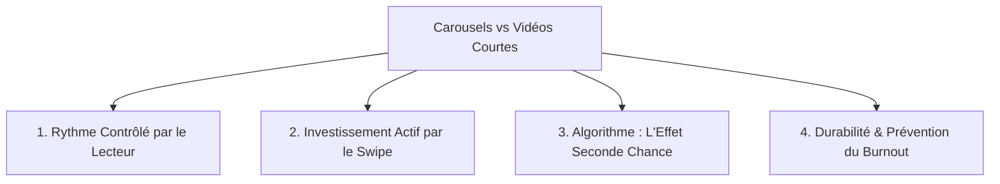

# 🎙️ Guide d'Étude & Synthèse Stratégique — NotebookLM Edition

> **Source** : *Instagram Carousels Are Better Than You Think* — Gaku Lange (Gakuyen)  
> **Type de document** : Note de cadrage & Playbook de création de contenu  
> **Audience cible** : Créateurs, Développeurs, Designers, Entrepreneurs & Professionnels du digital

---

## 📌 1. Vue d'Ensemble & Thèse Centrale (*Executive Summary*)

Dans cette intervention, le créateur **Gaku Lange (Gakuyen)** déconstruit la dépendance exclusive aux formats vidéo courts (Reels, TikTok, Shorts) et démontre pourquoi le **Carousel d'images** est devenu l'outil le plus puissant et sous-estimé pour construire une audience engagée et durable.

Alors que les vidéos courtes favorisent une découverte rapide mais superficielle, **les carousels permettent de bâtir une relation de confiance profonde**, d'obtenir des taux de sauvegarde records et de préserver l'énergie du créateur contre le surmenage.

---

## 🔑 2. Les 4 Avantages Majeurs du Format Carousel

### 1. Le "Breathing Room" (Contrôle du Rythme par le Lecteur)

* **Format Vidéo** : L'audience subit un flux continu et des transitions rapides. Impossible de s'arrêter pour étudier un schéma ou relire un concept sans interrompre la lecture.
* **Format Carousel** : L'utilisateur contrôle son propre tempo (5 secondes sur une citation, 30 secondes sur un schéma technique). C'est le format par excellence pour l'apprentissage, les tutoriels, le design et les réflexions structurées.

### 2. L'Investissement Psychologique par le "Swipe"

* Le geste de glisser le doigt (*swipe*) constitue un micro-engagement physique. Chaque slide consultée augmente l'attention et la rétention de l'information.
* **Signal algorithmique** : Un utilisateur qui fait défiler 7 slides envoie à la plateforme un signal d'engagement bien plus qualitatif qu'un visionnage passif.

### 3. Le "Second Chance Effect" de l'Algorithme

* Contrairement à une vidéo qui n'apparaît qu'une fois dans le flux d'un utilisateur, le carousel bénéficie d'un mécanisme algorithmique unique :
  
  > [!TIP]
  > Si un utilisateur voit la publication sans s'arrêter, la plateforme lui reproposera le même post plus tard dans la journée **en affichant directement la Slide 2 ou la Slide 3** comme nouvelle image de couverture.

### 4. Durabilité & Économie d'Énergie pour le Créateur

* Concevoir un carousel axé sur la valeur requiert de la clarté intellectuelle mais **zéro logistique lourde** (pas de caméra professionnelle, de tournage, d'éclairage ou de montage vidéo chronophage).

---

## 📐 3. L'Anatomie d'un Carousel Performant (Le Framework en 3 Parties)

| Section                     | Slides             | Fonction Stratégique                                             | Règle d'Or                                                           |
|:--------------------------- |:------------------:|:---------------------------------------------------------------- |:-------------------------------------------------------------------- |
| **L'Accroche (*The Hook*)** | **Slide 1**        | Capter l'attention dans le flux et formuler une promesse claire. | Titre court (< 10 mots), fort contraste visuel, typographie soignée. |
| **Le Cœur de Valeur**       | **Slides 2 à 6/7** | Dérouler la méthode, l'analyse ou la solution étape par étape.   | **1 seule idée forte par slide**. Clarté visuelle et concision.      |
| **La Clôture (*The CTA*)**  | **Dernière Slide** | Transformer l'intérêt en action durable.                         | Incitation explicite à l'enregistrement (*Save 📌*) ou au partage.   |

---

## 💡 4. Clés d'Analyse & Questions Fréquentes (FAQ)

### Pourquoi les carousels génèrent-ils autant de sauvegardes (*Saves*) ?

> Les carousels éducatifs sont perçus comme des fiches pratiques ou des mini-guides de référence. Les utilisateurs les enregistrent pour pouvoir s'y référer ultérieurement, ce qui constitue pour les algorithmes modernes le premier indicateur de contenu à haute valeur ajoutée.

### Comment recycler des connaissances existantes en carousels (*Content Repurposing*) ?

> Tout document de travail, schéma de réflexion, extrait de note ou retour d'expérience peut être condensé en 5 à 7 diapositives. Il s'agit d'extraire la substantifique moelle d'un sujet pour la rendre immédiatement actionnable.

---

## 🛠️ 5. Le Playbook de Création Pas à Pas

1. **Identifier 1 problème spécifique** résolu récemment ou une compétence clé à transmettre.
2. **Formuler le Hook (Slide 1)** : poser la question que l'audience cible se pose ou annoncer une méthode éprouvée.
3. **Structurer le contenu intermédiaire (Slides 2 à 6)** :
   * *Diapo 2* : Le diagnostic ou l'erreur courante.
   * *Diapos 3 à 5* : Le cadre méthodologique ou les étapes concrètes (avec schémas/visuels).
   * *Diapo 6* : La synthèse ou le résultat obtenu.
4. **Appliquer un appel à l'action (Slide 7)** : *« Enregistrez ce post pour l'appliquer lors de votre prochain projet 📌 »*.
